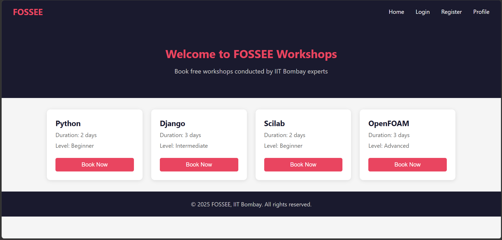
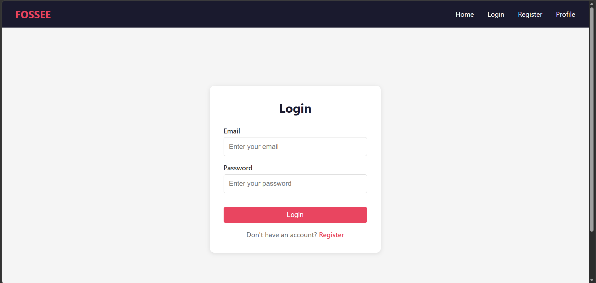
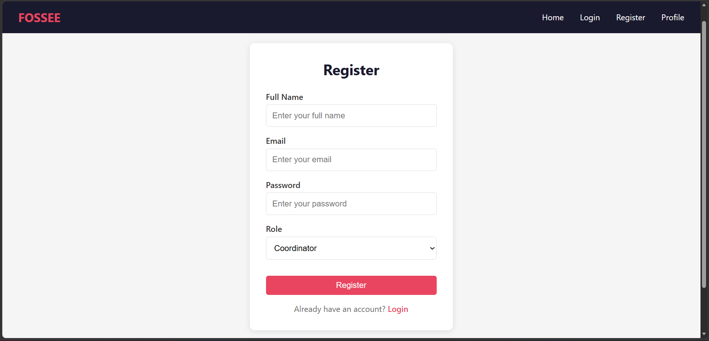
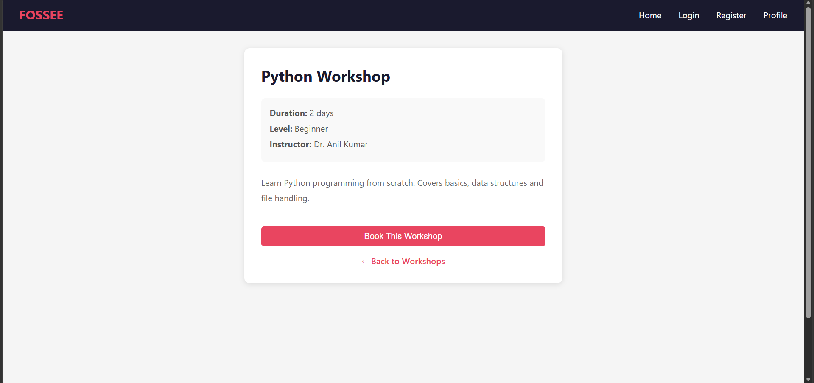
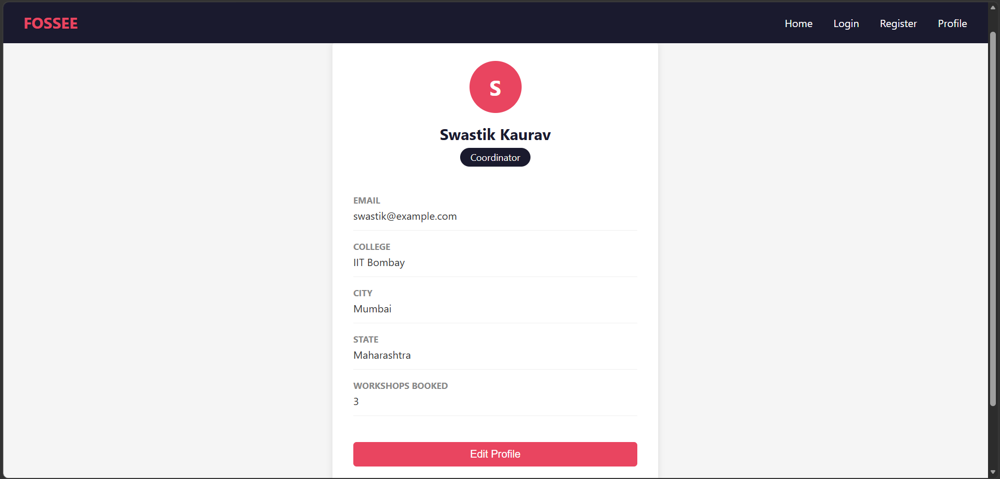

# FOSSEE Workshop Booking - UI Redesign

## About
This is a React-based frontend redesign of the FOSSEE Workshop Booking portal built with Vite + React.

## Live Demo
https://workshop-booking-iitb.netlify.app/

## Setup Instructions
1. Clone the repository
2. Navigate to frontend folder: `cd frontend`
3. Install dependencies: `npm install`
4. Run the app: `npm run dev`
5. Open `http://localhost:5173`

## Project Structure

```
workshop-ui/
├── Screenshots/               
├── frontend/                  
│   ├── public/                
│   └── src/
│       ├── components/        
│       │   ├── Navbar.jsx     
│       │   ├── Navbar.css     
│       │   ├── Footer.jsx     
│       │   └── Footer.css     
│       ├── pages/             
│       │   ├── Home.jsx       
│       │   ├── Home.css       
│       │   ├── Login.jsx      
│       │   ├── Register.jsx   
│       │   ├── Auth.css       
│       │   ├── WorkshopDetail.jsx   
│       │   ├── WorkshopDetail.css   
│       │   ├── Profile.jsx    
│       │   └── Profile.css    
│       ├── App.jsx            
│       ├── main.jsx           
│       └── index.css          
└── README.md                  
```

## Pages
- Home - Workshop listing
- Login - User login
- Register - New user registration
- Workshop Detail - Individual workshop info
- Profile - User profile

## Design Principles
I focused on mobile-first design since most students access websites on their phones. I maintained a clean visual hierarchy with a consistent color scheme of dark navy and red throughout all pages to give it a modern and professional look.

## Responsiveness
Used CSS Grid and Flexbox for layouts. Added media queries for screens below 768px so all pages work well on mobile devices. The navbar stacks vertically on small screens and cards go single column.

## Trade-offs
I chose plain CSS over heavy UI frameworks like Bootstrap or Material UI to keep the app lightweight and fast loading. This means more manual styling but better performance.

## Challenges
The most challenging part was understanding React Router and how navigation works between pages. I approached it by building one page at a time and testing each route before moving to the next.

## Screenshots

### Home Page


### Login Page


### Register Page


### Workshop Detail Page


### Profile Page

